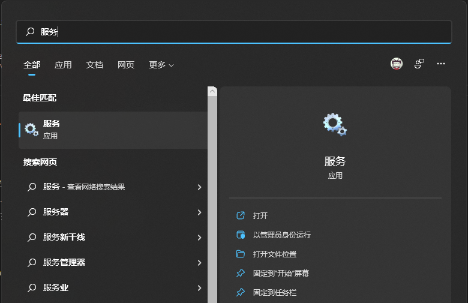
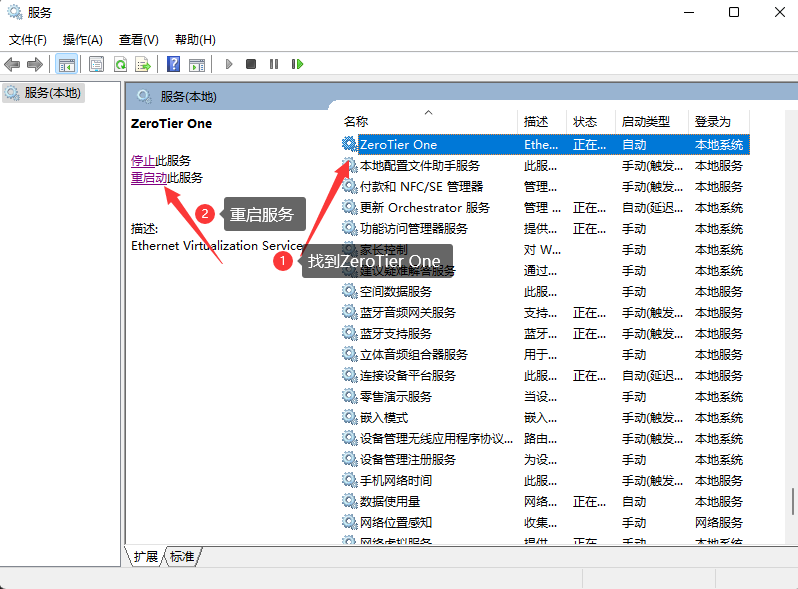

# ZeroTier-Controller
进入项目目录
```
cd docker-zerotier-planet
```

运行 `deploy.sh` 脚本
```
./deploy.sh
```

根据提示来选择即可，操作完成后会自动部署
```
欢迎使用zerotier-planet脚本，请选择需要执行的操作：
1. 安装
2. 更新
其他任意键退出

```

整个脚本预计需要 3-10 分钟,具体需要看网络与机型


当您看到类似如下字样时，表示安装成功
```
启动服务                                                                                                                                        
3b59df95edabeabbf19aa6605b28704608710719bdf7c6e7612d75d01ede8f48                                                                                
Preparing to copy...
Copying from container - 512B
Copying from container - 769B
Copying from container - 1.024kB
Copying from container - 1.536kB
Successfully copied 2.048kB to /tmp/planet
planet文件路径为 /tmp/planet
planet server端口为: 9994, 请在防火墙放行该端口的tcp和udp协议
enjoy~
```


##  下载 `planet` 文件
脚本运行完成后，会在 `/tmp/` 目录下有个 `planet` 文件

下载该文件以备用


# 客户端配置
客户端主要为Windows, Mac, Linux, Android

##  Windows 配置
首先去zerotier官网下载一个zerotier客户端

将 `planet` 文件覆盖粘贴到`C:\ProgramData\ZeroTier\One`中(这个目录是个隐藏目录，需要运允许查看隐藏目录才行)

Win+S 搜索 `服务`



找到ZeroTier One，并且重启服务




###  加入网络
使用管理员身份打开PowerShell

执行如下命令，看到join ok字样就成功了
```
PS C:\Windows\system32> zerotier-cli.bat join 网络id(就是在网页里面创建的那个网络)
200 join OK
PS C:\Windows\system32>
```

登录管理后台可以看到有个个新的客户端，勾选Authorized就行


执行如下命令：
```
PS C:\Windows\system32> zerotier-cli.bat peers
200 peers
<ztaddr>   <ver>  <role> <lat> <link> <lastTX> <lastRX> <path>
fcbaeb9b6c 1.8.7  PLANET    52 DIRECT 16       8994     1.1.1.1/9993
fe92971aad 1.8.7  LEAF      14 DIRECT -1       4150     2.2.2.2/9993
PS C:\Windows\system32>
```
可以看到有一个 PLANTET 和 LEAF 角色，连接方式均为 DIRECT(直连)

到这里就加入网络成功了

##  Linux 客户端
步骤如下：

1. 安装linux客户端软件
2. 进入目录 `/var/lib/zerotier-one`
3. 替换目录下的 `planet` 文件
4. 重启 `zerotier-one` 服务(`service zerotier-one restart`)
5. 加入网络 `zerotier-cli join` 网络 `id`
6. 管理后台同意加入请求
7. `zerotier-cli peers` 可以看到` planet` 角色

## 安卓客户端配置
[Zerotier 非官方安卓客户端发布：支持自建 Moon 节点 - V2EX](https://www.v2ex.com/t/768628)

## MacOS 客户端配置
步骤如下：

1. 进入 `/Library/Application\ Support/ZeroTier/One/` 目录，并替换目录下的 `planet` 文件
2. 重启 ZeroTier-One：`cat /Library/Application\ Support/ZeroTier/One/zerotier-one.pid | sudo xargs kill`
3. 加入网络 `zerotier-cli join` 网络 `id`
4. 管理后台同意加入请求
5. `zerotier-cli peers` 可以看到` planet` 角色

# 参考链接
[zerotier-虚拟局域网详解](https://www.glimmer.ltd/2021/3299983056/)

[五分钟自建 ZeroTier 的 Planet/Controller](https://v2ex.com/t/799623)

# 5. 管理面板SSL配置
管理面板的SSL支持需要自行配置，参考Nginx配置如下：
```
upstream zerotier {
  server 127.0.0.1: 3443;
}

server {

  listen 443 ssl;

  server_name {CUSTOME_DOMAIN}; #替换自己的域名

  # ssl证书地址
  ssl_certificate    pem和或者crt文件的路径;
  ssl_certificate_key key文件的路径;

  # ssl验证相关配置
  ssl_session_timeout  5m;    #缓存有效期
  ssl_ciphers ECDHE-RSA-AES128-GCM-SHA256:ECDHE:ECDH:AES:HIGH:!NULL:!aNULL:!MD5:!ADH:!RC4;    #加密算法
  ssl_protocols TLSv1 TLSv1.1 TLSv1.2;    #安全链接可选的加密协议
  ssl_prefer_server_ciphers on;   #使用服务器端的首选算法


  location / {
    proxy_pass http: //zerotier;
    proxy_set_header HOST $host;
    proxy_set_header X-Forwarded-Proto $scheme;
    proxy_set_header X-Real-IP $remote_addr;
    proxy_set_header X-Forwarded-For $proxy_add_x_forwarded_for;
    }
}

server {
    listen       80;
    server_name  {CUSTOME_DOMAIN}; //替换自己的域名
    return 301 https: //$server_name$request_uri;
}
```
